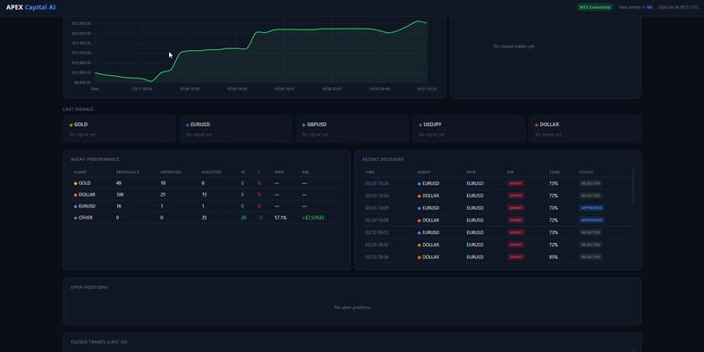

<div align="center">

# Claude Trader

### An autonomous AI trading system built in Python

[](https://python.org)
[](https://anthropic.com)
[](https://www.metatrader5.com)
[](LICENSE)
[](CONTRIBUTING.md)


**14 specialized Claude AI agents** that read the market, form a daily view, find entries, manage risk, monitor positions in real time, and report performance — fully autonomously, 24/7.

[Features](#features) · [Architecture](#architecture) · [Backtest Results](#backtest-results) · [Quick Start](#quick-start) · [Configuration](#configuration) · [How It Works](#how-it-works)

</div>

---

## What Is This?

Claude Trader is a fully autonomous trading system that connects the **Claude API** to **MetaTrader 5**. It runs as a team of 14 specialized AI agents with distinct roles — a daily strategist, macro analysts, entry specialists, a capital manager, and real-time position watchers — all coordinated through a single main loop.

It trades **EURUSD, XAUUSD, USDJPY, GBPUSD** on a MetaTrader 5 demo account with:
- A **STRATEGIST** that runs a top-down D1→H4→H1 analysis once per day at 07:00 UTC
- **Entry agents** that look for setups every 15 minutes using SMC, EMAs, RSI, ADX, Ichimoku
- A **MANAGER** (Claude Opus) that reviews every proposal through 9 hard risk checks before approving
- A **MONITOR** that watches open positions every 10 seconds and trails stops on favorable spikes
- A **live dashboard**, Telegram alerts, and full session reports at NY close

---

## Key Numbers

| Metric | Value |
|---|---|
| AI Agents | 14 specialized roles |
| Instruments | EURUSD · XAUUSD · USDJPY · GBPUSD |
| Main loop frequency | Every 15 minutes |
| Watch loop frequency | Every 10 seconds |
| Backtest period | Jan 2024 – Mar 2026 (2+ years) |
| Backtest P&L | **+$5,046 (+41.4%)** on $12,200 |
| Max drawdown | 4.2–6.9% per instrument |
| Risk per trade | 1% of equity (configurable) |
| Daily loss limit | 3% → full halt |

---

## Features

**AI Layer**
- Claude Opus for daily market structure analysis (STRATEGIST) and final trade approval (MANAGER)
- Claude Sonnet for 5 entry/macro agents and 4 real-time position watchers
- Optional second AI brain (DeepSeek / GPT-4o) for position management consensus

**Trading Logic**
- EMA200 macro gate — only trade in direction of structural trend
- RSI 58/42 momentum threshold — filters weak setups
- ADX rising filter — avoids entering exhausted trends
- SMC detection — Fair Value Gaps, Order Blocks, Liquidity pools (EURUSD, GBPUSD, GOLD)
- Ichimoku cloud confirmation (USDJPY)
- Fibonacci confluence (GOLD)
- 4-pillar DXY macro compass — basket + rate differential + Fed rhetoric + technicals

**Risk Management**
- 9 hard checks before every trade: daily loss, margin, confidence, regime, correlation, R:R, pyramiding
- Dynamic lot sizing — scales with equity, ADX strength, proximity to BoJ intervention zone
- Portfolio risk ceiling (2% total open risk)
- Consecutive loss protection (3 losses → 1hr pause)
- Spike classification — ADVERSE vs FAVORABLE — with AI decision on each

**Operations**
- Real-time Telegram alerts for every position event (open, SL moved, closed)
- One consolidated cycle report per 15-min cycle (not one message per agent)
- Auto session report at 19:00 UTC (NY close) and on shutdown
- Telegram commands: `/positions` `/close <ticket>` `/closeall` `/status`
- Live dashboard at `http://localhost:8080` (balance curve, agent P&L, open positions, last signals)
- Rule-based backtest engine (no Claude API cost) with SMC vs baseline comparison

**Learning**
- STRATEGIST accumulates persistent memory (`logs/strategist_memory.json`) across days
- Learns which levels held, which regimes produced wins, how each instrument behaves
- RSS web intelligence (Fed, ECB, BoE, ForexLive, FXStreet) injected into daily plans

---

## Architecture

```
                    ┌─────────────────────────────────┐
                    │          Claude Trader            │
                    └─────────────────────────────────┘
                                    │
              ┌─────────────────────┼─────────────────────┐
              │                     │                       │
     ┌────────▼────────┐   ┌────────▼────────┐   ┌────────▼────────┐
     │   MAIN LOOP     │   │   WATCH LOOP    │   │    DAILY        │
     │  every 15 min   │   │  every 10 sec   │   │   07:00 UTC     │
     └────────┬────────┘   └────────┬────────┘   └────────┬────────┘
              │                     │                       │
     ┌────────▼────────┐   ┌────────▼────────┐   ┌────────▼────────┐
     │ NEWS  (no AI)   │   │ MONITOR         │   │ STRATEGIST      │
     │ TRACKER + MT5   │   │ ├ GOLD_WATCH    │   │ D1+H4+H1 plans  │
     │ MANAGER (Opus)  │   │ ├ EURUSD_WATCH  │   │ per instrument  │
     │ DOLLAR (Sonnet) │   │ ├ GBPUSD_WATCH  │   │ (Claude Opus)   │
     │ GOLD   (Sonnet) │   │ └ USDJPY_WATCH  │   └─────────────────┘
     │ EURUSD (Sonnet) │   │ ADVERSE→CLOSE?  │
     │ GBPUSD (Sonnet) │   │ FAVORABLE→TRAIL?│
     │ USDJPY (Sonnet) │   │ CMD LISTENER    │
     │ MT5_EXECUTOR    │   └─────────────────┘
     └─────────────────┘
```

### Full Agent Roster

| Agent | Model | Role |
|---|---|---|
| **MANAGER** | Claude Opus | CEO — reads MT5 account, runs 9 risk checks, final approval |
| **STRATEGIST** | Claude Opus | Daily top-down analyst — D1+H4+H1 execution plans (4×/day) |
| **NEWS** | Rule-based | Monitors ForexFactory, RSS, Fear/Greed — no AI cost |
| **TRACKER** | Rule-based | Performance analyst — decisions + positions + session reports |
| **DOLLAR** | Claude Sonnet | 4-pillar DXY macro compass + EURUSD trade proposals |
| **GOLD** | Claude Sonnet | XAUUSD specialist — 4-pillar + SMC + Fibonacci |
| **EURUSD** | Claude Sonnet | Trend + mean reversion + SMC |
| **GBPUSD** | Claude Sonnet | Cable trend + mean reversion + SMC |
| **USDJPY** | Claude Sonnet | Pure trend following + Ichimoku |
| **MONITOR** | Thread manager | Watch loop orchestrator + Telegram command listener |
| **GOLD_WATCH** | Claude Sonnet | XAUUSD position specialist — spike aware |
| **EURUSD_WATCH** | Claude Sonnet | EURUSD position specialist — spike aware |
| **GBPUSD_WATCH** | Claude Sonnet | GBPUSD position specialist — spike aware |
| **USDJPY_WATCH** | Claude Sonnet | USDJPY position specialist — spike aware |

---

## Backtest Results

All backtests: $12,200 starting balance · 1% risk per trade · 2 years of data (Jan 2024 – Mar 2026)

```
Agent    Symbol   Trades  Win Rate   Profit Factor   P&L         Max DD
──────────────────────────────────────────────────────────────────────────
GOLD     XAUUSD     44     33.3%        3.71        +$2,645     1.6%
EURUSD   EURUSD     58     35.7%        1.56        +$1,236     6.2%
GBPUSD   GBPUSD     29     20.0%        1.50          +$549     4.2%
USDJPY   USDJPY     20     25.0%        1.79          +$616     2.9%
──────────────────────────────────────────────────────────────────────────
TOTAL                                               +$5,046    +41.4%
```

> Win rate excludes time-exits (15-hour cap). MONITOR's live SL trailing converts many time-exits to wins in live trading — the backtest is conservative.

Run it yourself:
```bash
python backtest.py --all --compare --from 2024-01-01 --csv
```

---

## Quick Start

### Prerequisites
- Python 3.10+
- MetaTrader 5 installed (Windows — MT5 only runs on Windows)
- A MetaTrader 5 demo or live account
- [Anthropic API key](https://console.anthropic.com/)
- [Telegram bot](https://core.telegram.org/bots#botfather) (optional but recommended)

### 1. Clone & install

```bash
git clone https://github.com/YOUR_USERNAME/claude-trader.git
cd claude-trader
pip install -r requirements.txt
```

### 2. Configure credentials

```bash
cp .env.example .env
# Edit .env with your MT5 login, Anthropic API key, and Telegram token
```

### 3. Run a single cycle (test)

```bash
python main.py
```

### 4. Run 24/7 (both loops)

```bash
python main.py --loop
```

### 5. Open the dashboard

```bash
python dashboard_server.py
# → http://localhost:8080
```

---

## Configuration

All configuration lives in `.env`. Copy `.env.example` to get started.

| Variable | Description | Default |
|---|---|---|
| `ANTHROPIC_API_KEY` | Anthropic Claude API key | required |
| `MT5_LOGIN` | MetaTrader 5 account number | required |
| `MT5_PASSWORD` | MT5 account password | required |
| `MT5_SERVER` | MT5 broker server | `MetaQuotes-Demo` |
| `TELEGRAM_TOKEN` | Telegram bot token | optional |
| `TELEGRAM_CHAT_ID` | Your Telegram chat ID | optional |
| `MAX_RISK_PER_TRADE_PCT` | Risk per trade as % of equity | `0.01` (1%) |
| `MAX_DAILY_LOSS_PCT` | Daily loss limit before halt | `0.03` (3%) |
| `MAX_OPEN_POSITIONS` | Max simultaneous positions | `3` |
| `SPIKE_XAUUSD` | Gold spike threshold ($ per M1 candle) | `15.0` |
| `SPIKE_EURUSD` | EURUSD spike threshold (price per M1) | `0.003` |
| `SPIKE_GBPUSD` | GBPUSD spike threshold | `0.004` |
| `SPIKE_USDJPY` | USDJPY spike threshold | `0.80` |
| `SECOND_BRAIN_PROVIDER` | Second AI for watch loop (`deepseek`/`openai`) | `deepseek` |
| `NEWS_API_KEY` | NewsAPI.org key (optional) | — |

---

## How It Works

### Daily Strategy (07:00 UTC)

```
STRATEGIST reads D1 + H4 + H1 candles for all 4 instruments
  → Identifies market structure (HH/HL, LH/LL), key levels, entry zones
  → Fetches live macro intelligence (Fed RSS, ECB, BoE, ForexLive)
  → Reads persistent memory from previous days
  → Writes execution plan: bias / entry_zone / invalidation / TP / SL
  → Distributes plans to all 4 entry agents
  → Sends Telegram summary
```

### Main Cycle (every 15 min)

```
1. NEWS     → ForexFactory events, RSS headlines, Fear/Greed index
2. TRACKER  → Check performance, open positions, alert MANAGER
3. MANAGER  → Read live MT5 account (balance, equity, positions)
4. DOLLAR   → 4-pillar DXY analysis → broadcast macro regime to all agents
5. Specialists → GOLD / EURUSD / GBPUSD / USDJPY analyse their instrument
6. MANAGER  → Run 9 hard checks on every proposal
             → Claude Opus final review (sees news + macro + proposal)
             → APPROVED / REJECTED / HOLD
7. MT5      → Execute approved trades live
8. MANAGER  → Send one consolidated Telegram report
```

### Watch Loop (every 10 sec)

```
MONITOR checks all open positions
  → ADVERSE spike  (price moving against trade)
      → Claude: close early or trust the SL?
  → FAVORABLE spike (price moving with trade)
      → Claude: trail both SL and TP to lock profit?
  → Profit milestone hit (1x SL, 1.5x SL, 2x SL)
      → Auto move SL to breakeven → lock profit → ATR trail
  → Telegram alert on any action taken
```

---

## Telegram Commands

Once running with `--loop`, you can control the bot from your Telegram chat:

| Command | Action |
|---|---|
| `/positions` | List all open positions with entry, SL, TP, floating P&L |
| `/status` | Account balance, equity, floating P&L, bot status |
| `/close <ticket>` | Close one specific position |
| `/closeall` | Close ALL open positions immediately |

---

## Project Structure

```
claude-trader/
├── main.py                  ← Entry point — two loops, full team
├── mt5_executor.py          ← Live MT5 order placement and closing
├── dashboard_server.py      ← HTTP dashboard server (port 8080)
├── dashboard.html           ← Dashboard frontend (dark theme, Chart.js)
├── backtest.py              ← Rule-based historical backtest (no API cost)
├── download_histdata.py     ← Downloads 5-year M1→M15 data from HistData.com
├── create_backtest_report.py← Generates Excel report from backtest results
├── requirements.txt
├── .env.example
├── agents/
│   ├── manager.py           ← CEO: risk engine, evaluator, Telegram
│   ├── news.py              ← News & sentiment (rule-based, no AI)
│   ├── tracker.py           ← Performance analyst + session reports
│   ├── strategist.py        ← Daily top-down analyst (Claude Opus)
│   ├── dollar.py            ← DXY macro compass (4 pillars)
│   ├── gold.py              ← XAUUSD entry specialist
│   ├── eurusd.py            ← EURUSD entry specialist
│   ├── gbpusd.py            ← GBPUSD entry specialist (Cable)
│   ├── usdjpy.py            ← USDJPY entry specialist
│   ├── monitor.py           ← Watch loop + Telegram command listener
│   ├── gold_watch.py        ← XAUUSD position monitor
│   ├── eurusd_watch.py      ← EURUSD position monitor
│   ├── gbpusd_watch.py      ← GBPUSD position monitor
│   ├── usdjpy_watch.py      ← USDJPY position monitor
│   └── cot.py               ← COT institutional positioning data
└── logs/                    ← Auto-created, excluded from git
    ├── trades.json
    ├── executions.json
    └── strategist_memory.json
```

---

## Deployment (VPS)

For 24/7 operation, deploy to a Windows VPS with MT5 installed.

**Recommended:** Contabo VPS (~$7/month) or any Windows Server with Python 3.10+

```bash
# Auto-start on boot via Task Scheduler
# Action: python C:\claude-trader\main.py --loop
# Trigger: At system startup
# Run whether user is logged on or not
```

For going live (real money), reduce risk first:
```bash
MAX_RISK_PER_TRADE_PCT=0.005  # 0.5% per trade
MAX_OPEN_POSITIONS=2          # max 2 simultaneous
```

---

## Tech Stack

| Technology | Purpose |
|---|---|
| [Claude API](https://docs.anthropic.com/) | AI reasoning — Opus for strategy/approval, Sonnet for analysis |
| [MetaTrader 5](https://www.metatrader5.com/) | Broker connectivity, live data, trade execution |
| [ForexFactory](https://forexfactory.com/) | Economic calendar — primary risk driver |
| [FRED API](https://fred.stlouisfed.org/) | US 10Y Treasury yield |
| [ECB API](https://sdw.ecb.europa.eu/) | German Bund 10Y yield |
| [Telegram Bot API](https://core.telegram.org/bots) | Real-time alerts and commands |
| [feedparser](https://feedparser.readthedocs.io/) | RSS feeds (Fed, ECB, BoE, ForexLive, FXStreet, Reuters) |
| [Chart.js](https://www.chartjs.org/) | Dashboard charts |
| pandas / numpy | Technical indicator calculation |

---

## Roadmap

- [x] 14-agent architecture with live MT5 execution
- [x] STRATEGIST daily top-down analysis with persistent memory
- [x] SMC detection (FVG, Order Blocks, Liquidity pools)
- [x] Real-time spike management (ADVERSE / FAVORABLE)
- [x] 2-year rule-based backtest with SMC comparison
- [x] Live performance dashboard
- [x] Telegram commands (/positions, /close, /closeall, /status)
- [ ] VPS deployment + auto-restart watchdog
- [ ] COT institutional positioning as 5th pillar for GOLD/DOLLAR
- [ ] Real Claude backtest (validate AI filtering layer vs mechanical signals)
- [ ] Live account migration (0.5% risk, 2 positions)
- [ ] USDCAD / XAGUSD as additional instruments

---

## Disclaimer

**This software is for educational and research purposes only.**

Forex and commodities trading involves substantial risk of loss and is not suitable for all investors. Past backtest results do not guarantee future performance. This system trades real money on a live MT5 account when configured with live credentials.

- Never trade with money you cannot afford to lose
- Always test thoroughly on a demo account before going live
- The authors are not responsible for any financial losses incurred
- This is not financial advice

---

## Contributing

Contributions are welcome. See [CONTRIBUTING.md](CONTRIBUTING.md) for guidelines.

**Good first issues:**
- Add a new instrument (template in `CLAUDE.md`)
- Improve COT data integration (`agents/cot.py`)
- Add a watchdog process for crash recovery
- Improve the backtest to model MONITOR's SL trailing behavior

---

## License

[MIT](LICENSE) — free to use, modify, and distribute.

---

<div align="center">

Built with the [Claude API](https://docs.anthropic.com/) · Trades on [MetaTrader 5](https://www.metatrader5.com/)

If this helped you, consider giving it a ⭐

</div>
